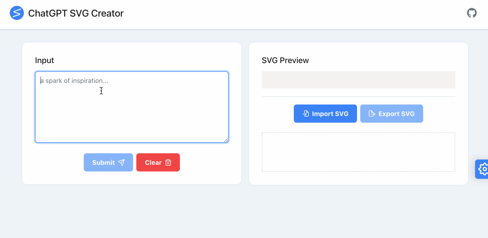
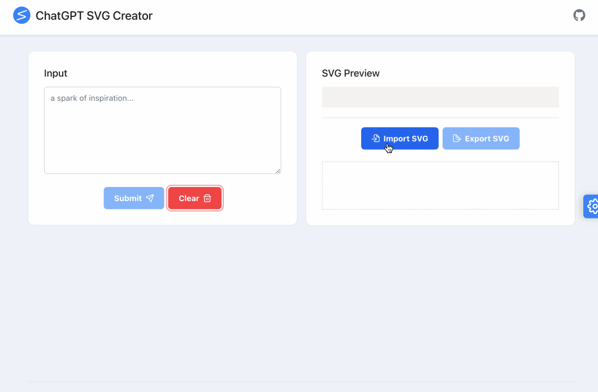

  
  <h3 align="center">ChatGPT SVG Creator</h3>
  

    A simple tool for creating, modifying, and previewing SVGs using ChatGPT
  

  

    English | <a href="./README_CN.md">中文</a>
  

  
Table of Contents

  <ul>
    <li><a href="#overview">Overview</a></li>
    <li><a href="#main-features">Main Features</a></li>
    <li><a href="#demo">Demo</a></li>
    <li><a href="#local-startup">Local Startup</a></li>
    <li><a href="#see-also">See Also</a></li>
  </ul>

## Overview

With the ChatGPT SVG Creator extension, you can design and modify SVGs using natural language, offering basic previewing, importing, and exporting capabilities.

#### How to use

1. Configure OpenAI-related parameters in `Settings` before using.
2. Import an existing SVG or start from scratch.
3. For each subsequent conversation round, GPT will append the SVG previewed on the right as a prompt.
4. Export your work.

## Main Features

* Design and modify SVGs using natural language
* Basic SVG preview functionality
* Supports importing and exporting SVG source code and files

## Demo

#### Create a new SVG and modify it

#### Import an existing SVG and modify it

## Local Startup

1. clone this repo
2. `yarn && yarn start`

## See Also

[Browser Extension](https://github.com/xieziyu/chatgpt-svg-creator)